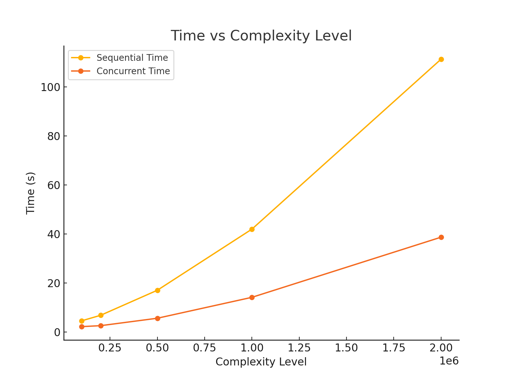
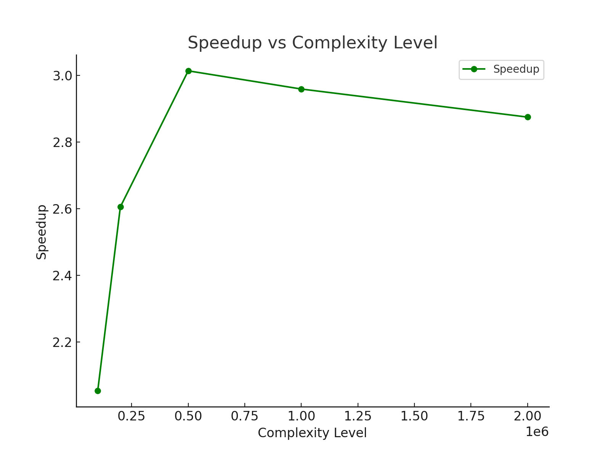
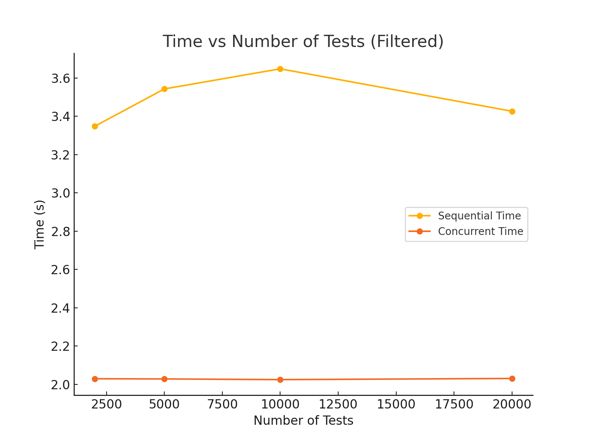
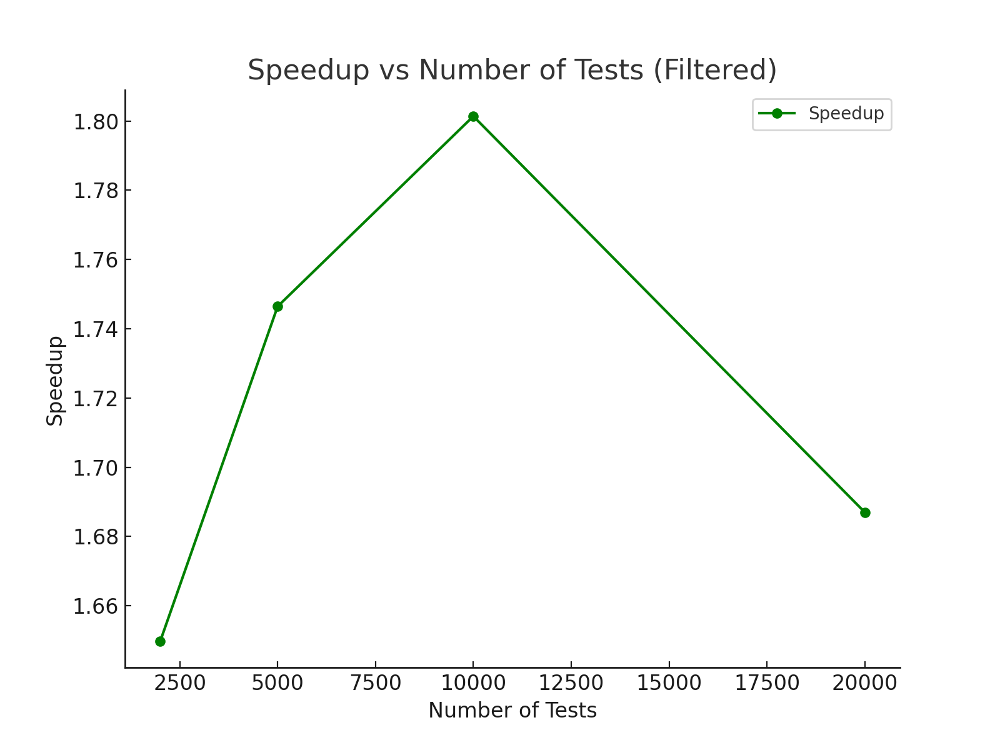

# Performance Analysis Report

## 1. Experiment Setup

In these experiments, we aim to measure the speedup achieved by running test cases concurrently versus running them sequentially. The tests involve computing large primes, factorials, and integrals, as well as running a large number of trivial "light" tests.

**Setup Details:**

- **Prime Computation (`computeLargePrime(int n)`):**  
  The `computeLargePrime` function computes the *n*-th prime number by checking each number for primality using trial division:

  ```cpp
  long long computeLargePrime(int n) {
      int count = 0;
      long long num = 2;
      while (count < n) {
          bool isPrime = true;
          for (long long i = 2; i <= std::sqrt(num); ++i) {
              if (num % i == 0) {
                  isPrime = false;
                  break;
              }
          }
          if (isPrime) {
              ++count;
          }
          ++num;
      }
      return num - 1;
  }
  ```

As n grows, this computation becomes significantly more expensive because of more prime checks. This function simulates complex CPU-bound work.

- **Heavy Prime Tests Setup (`HeavyPrimeTests_Registrar`)**:  
  The `HeavyPrimeTestsSuite` and its registration block dynamically create a number of heavy prime tests. Each test uses `computeLargePrime(g_primeTestCount)` internally. The number of tests is controlled by `g_numHeavyTests`, and the complexity of each test is controlled by `g_primeTestCount`.

  ```cpp
  static struct HeavyPrimeTests_Registrar {
      HeavyPrimeTests_Registrar() {
          for (int i = 0; i < g_numHeavyTests; ++i) {
              std::string testName = "HeavyPrimeTest_" + std::to_string(i);
              TestCase testCase(testName, [](TestFixture*, int) {
                  long long prime = computeLargePrime(g_primeTestCount);
                  ASSERT_TRUE(prime > 0);
              });
              HeavyPrimeTestsSuite->addTestCase(testCase);
          }
      }
  } HeavyPrimeTests_registrar;
  ```

**Other Control Variables:**
- `g_numLightTests`: Controls how many trivial tests to run.
- `g_numModerateTests`: Controls how many factorial tests to run.
- `g_numHeavyTests`: Controls how many heavy prime tests to run.
- `setPrimeTestCount(int n)`: Sets the complexity of the prime test (which prime number we attempt to compute).

**Concurrent vs Sequential Runs:**  
We use the `TestRunner` class to run tests either sequentially on a single thread or concurrently on multiple threads.

The number of thread corresponds to the number of physical cores on the machine using `std::thread::hardware_concurrency()`.
We conducted this experiment on a 2023 Mac M3 with 11 CPUs.

## 2. Experimental Results
We conducted three sets of experiments:

1. Speedup vs Complexity: Fixed number of tests, varied `g_primeTestCount`.
2. Speedup vs Input Size: Similar to complexity, varied prime count while keeping a moderate number of tests.
3. Speedup vs Number of Tests: Fixed complexity, varied the number of trivial tests.

Below are the summarized results:

### Speedup vs Complexity:

| ComplexityLevel | SequentialTime | ConcurrentTime | Speedup |
|-----------------|----------------|----------------|---------|
| 100000          | 4.62479        | 2.25243        | 2.05325 |
| 200000          | 6.86828        | 2.63638        | 2.60519 |
| 500000          | 17.0819        | 5.66847        | 3.0135  |
| 1000000         | 41.9898        | 14.1911        | 2.95888 |
| 2000000         | 111.262        | 38.7043        | 2.87467 |

Time vs Complexity Level:


Speedup vs Complexity Level



### Speedup vs Number of Tests:

| NumTests | SequentialTime | ConcurrentTime | Speedup |
|----------|----------------|----------------|---------|
| 1000     | 3.44774        | 2.03068        | 1.69783 |
| 2000     | 3.34821        | 2.02953        | 1.64975 |
| 5000     | 3.5427         | 2.02852        | 1.74645 |
| 10000    | 3.64772        | 2.02498        | 1.80137 |
| 20000    | 3.4263         | 2.03099        | 1.68701 |

Time vs Number of Tests:


Speedup vs Number of Tests:


## 3. Analysis of Results

### Speedup vs Complexity/Input Size:
As we increase `g_primeTestCount` (which increases the complexity of finding the n-th prime):

- We see an initial strong speedup (around 2x to 3x).
- The best speedups occur at moderate to high complexity levels (e.g., for 500000, we got around a 3.01x speedup).
- However, as complexity becomes extremely large (1,000,000 and 2,000,000), the speedup settles to around 2.7x to 3.0x. This is due to CPU saturation as all cores are fully utilized, and parallel overheads like thread management and synchronization become negligible compared to computation time.  
  Additionally, hardware-level bottlenecks such as memory access latency and CPU cache misses limit further scalability.

### Speedup vs Number of Tests:
When we vary the number of trivial tests:

- The speedup is more modest (between 1.6x to about 1.8x). Trivial tests perform minimal computations, so the concurrency benefits are limited.
- The thread management and synchronization costs dominate because the tasks complete too quickly relative to the setup overhead.
- For a very high number of trivial tests, running them sequentially becomes nearly as efficient as running them concurrently, as the time saved by concurrency is marginal compared to the fixed overhead.

## 4. Conclusion

- Concurrency provides a clear benefit for complex CPU-bound tests, up to a certain complexity level.
- The speedup tends to plateau at very high complexity due to full CPU utilization and threading overhead.
- For trivial tasks, the concurrency overhead diminishes the speedup, because the tasks are too fast and the synchronization
costs become relatively large.
